# Plntify, a MERN Stack app - GA Project Three

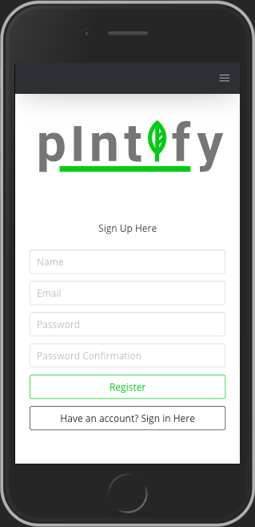

My third dev project for the Software Engineering Immersive course, a complex MERN stack app built with GA classmates [George Jones](https://github.com/jompra), [Jakub Horun](https://github.com/ykbhrn) and [Yarden Lawson](https://github.com/YBL123). 

The app has been deployed with Heroku and is available [here](https://plntify-ainokyto.herokuapp.com/).

Please note that user authentication is required, anyone interested in the app is welcome to use the admin credentials `aino@email` and password `pass`.

## Brief & Timeframe:

* Build a full-stack application by making your own backend and your own front-end
* Use an Express API to serve your data from a Mongo database
* Consume your API with a separate front-end built with React
* Be a complete product which most likely means multiple relationships and CRUD functionality for at least a couple of models
* Implement thoughtful user stories/wireframes that are significant enough to help you know which features are core MVP and which you can cut
* Have a visually impressive design
* Be deployed online so it's publicly accessible
* Timeframe: 8 days

## Technologies Used:

* Node.js
* Express
* MongoDB
* Mongoose
* JavaScript (ES6)
* React.js
* JWT
* Bcrypt
* Axios
* Git + GitHub
* Bulma CSS Framework
* react-select

### APIs Used:
* [Mapbox](https://www.mapbox.com/)
* [Trefle.io](https://trefle.io/)
* [Image Moderation](https://www.moderatecontent.com/)
* [Pexels](https://www.pexels.com/api/?locale=en-US)
* [Wikipedia](https://www.mediawiki.org/wiki/API:Main_page)

## Demonstration of the App Flow

#### The landing page where user is prompted to either login on register to access the site:

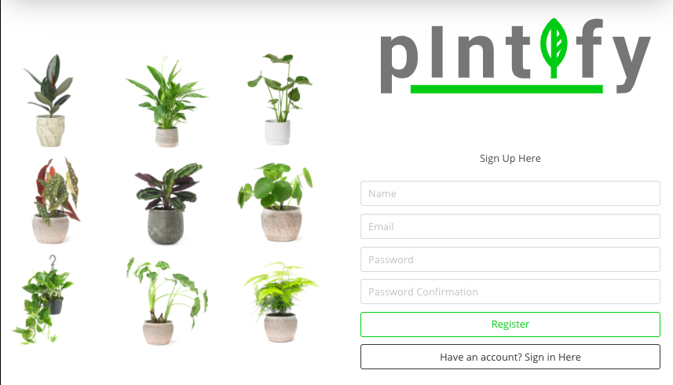

#### Home/Index page after signing in

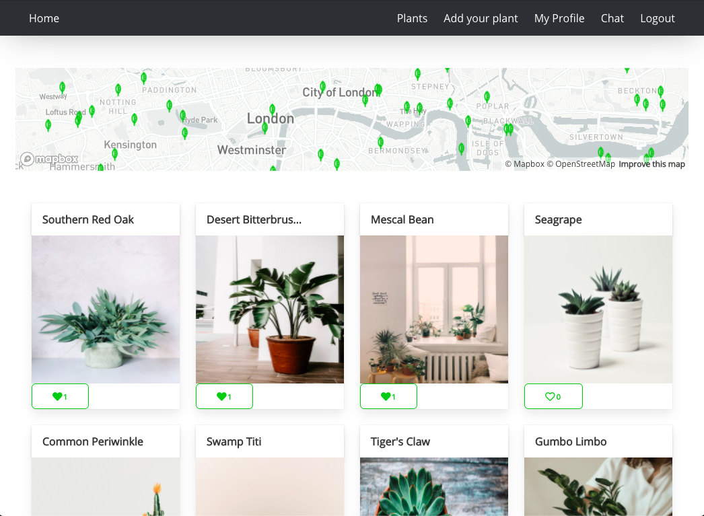

#### User can add plants to their portfolio, the Wikipedia API matches the plant name to a Wikipedia article to get accurate description content

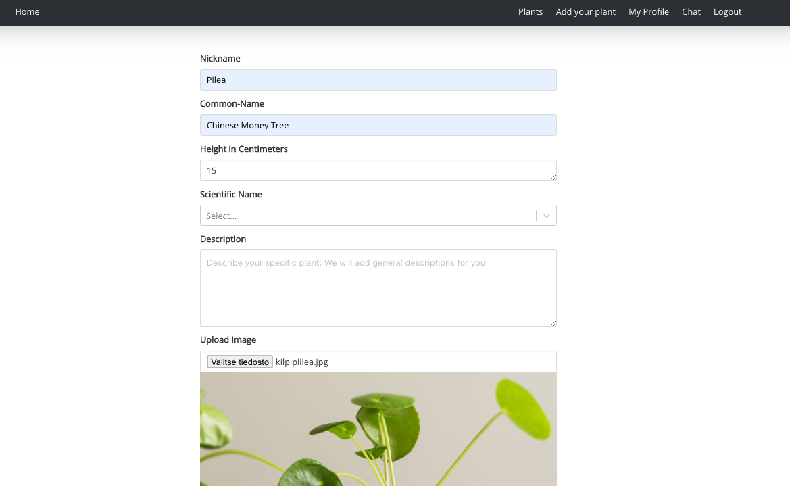

#### We're also checking the plant name and matching it to its the scientific name with Trefle.io API 

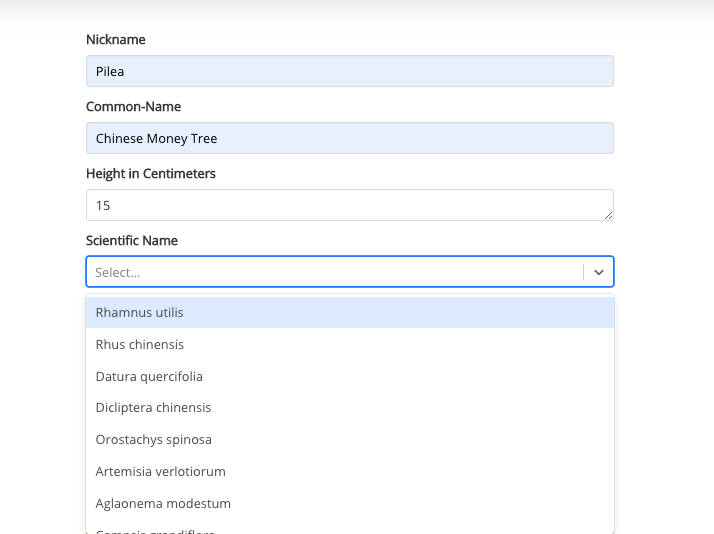

#### User can add a location to their plant. When user starts typing on the field, Mapbox GL API starts filtering place names to match the input

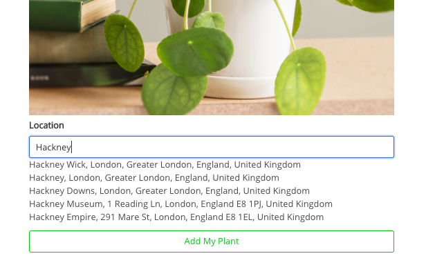

#### Single plant view and making an offer

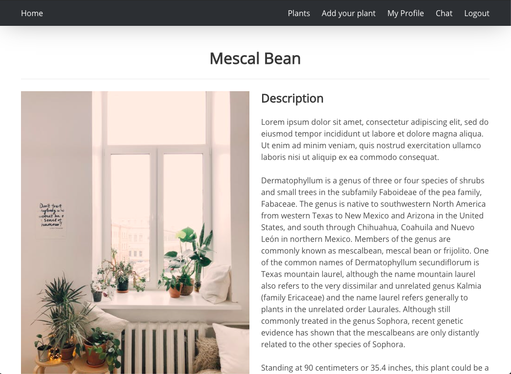
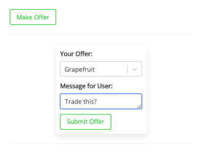

#### Received offers visible on user's own profile

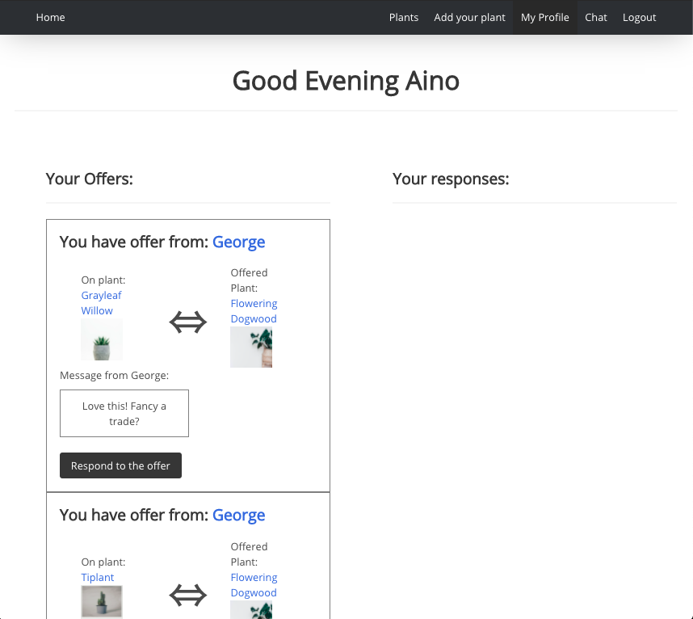

#### Map view of plants available for trade with search functionality

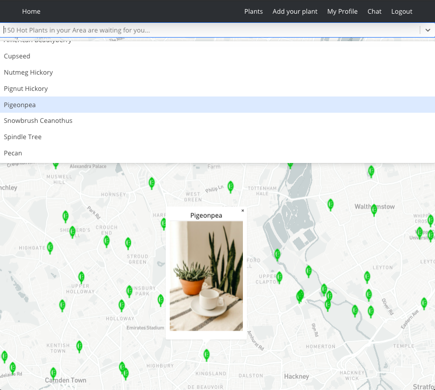

### Functionality 

The functionality is similar to many popular social sites. Users can:

* Register & login
* Get a feed of other users' plants 
* Like and comment other users' plants
* Post, edit and delete their own plants
* Offer their plants for trade 
* Message other users
* Search and browse for plants available for trade on map


## Process

After being given the brief, my team started out by brainstorming different ideas on what we wanted to do for our project. We soon came to realise that houseplants were a common interest, and after doing some more research, found the Trefle.io botanical API. An idea formed in our minds for a social location-based houseplant trading hub with our own RESTful API.
We wanted to use Agile Methodology for the project, so to ensure quality communication we set up a Trello board to keep track of our progress Kanban-style, and had daily stand-up with the team where we kept each other abreast of any issues. In addition, we communicated on Slack which we found to be a very efficient way of working as we were working remotely.

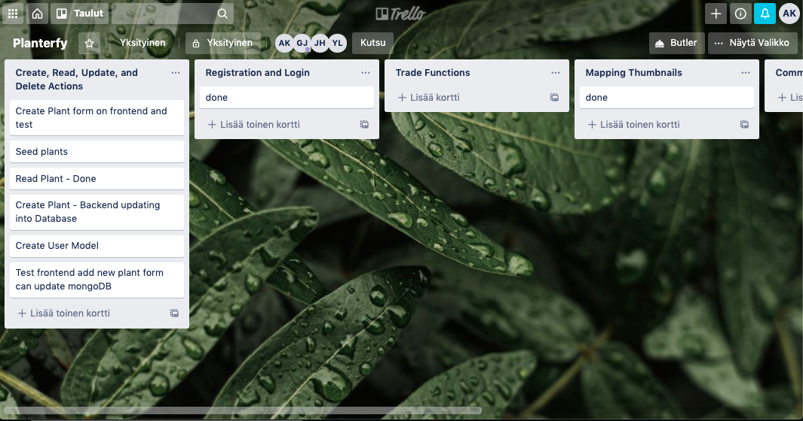

#### In order to understand how our app would work at a fundamental level we needed to sketch out models and functionality:

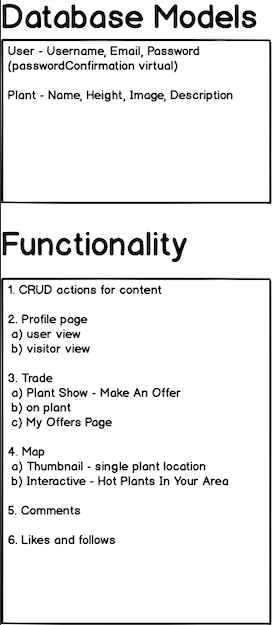

#### We then proceeded to create wireframes with [Balsamiq](https://balsamiq.cloud/) for the UI:

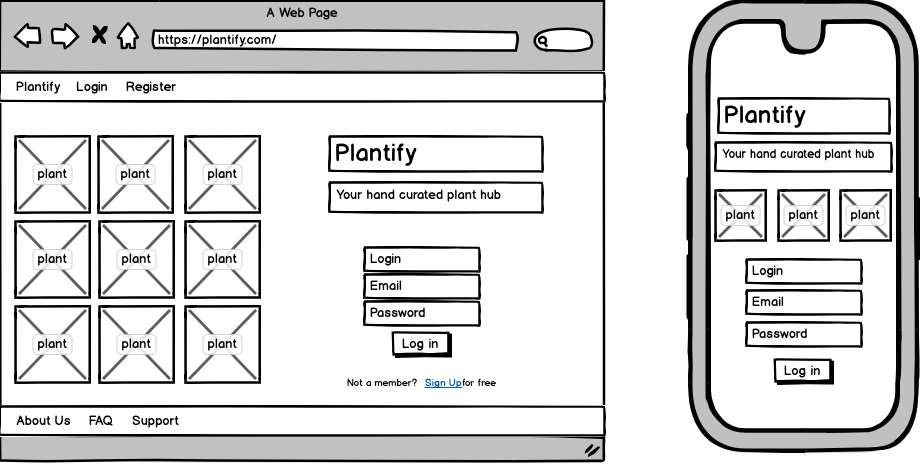

By day 2 we were happy with our wireframes and began working on our backend in Node.js, creating models, controllers, and routes. I created an initial seeds file to work with before we hooked up Trefle.io.

Then each of us started working on our respective areas of responsibility - this involved getting through heaps of documentation. Any blockers a team member struggled to overcome, we would all troubleshoot collaboratively to sort them out as efficiently as possible.

We reached MVP at an early stage, at the end of day 4. This allowed us a generous amount of time to work on any add-ons and nice-to-haves, as well as styling.

### Division of work 

For the division of work, we had every awareness that the workload would be bigger than anything that we'd build before. So we decided the best way to about it would be that all of us should be Full Stack Engineers and take full ownership of their respective area of responsibility - some of the more substantial tasks were assigned to multiple team members so we could solve big challenges quicker. Working this way we hoped to prevent any hurdles related to pipelines, to secure that our product would be ready in the timeframe given, and everyone would get the optimal learning experience from building a MERN Stack app. 
I was involved in everything, but my personal contribution to the project included building the Map functionality and implementing interactive, searchable Maps with Mapbox's React-Map-GL package, creating the initial seeds file, and pair-coding the Chat functionality together with [Jakub](https://github.com/ykbhrn) where users are able to send direct messages to one another.

### Featured piece of code

Building user interactions and search functionality required leveraging location data. Therefore the plant model, which was by far our most complicated model, has to have location data (latitude and longitude as key-value pairs):

```javascript
const plantSchema = new mongoose.Schema({
  nickName: { type: String, required: false },
  name: { type: String, required: true },
  scientificName: { type: String, required: true },
  trefleId: { type: Number, required: false },
  imageUrl: { type: String, required: true },
  description: { type: String, required: false, maxlength: 1000 },
  height: { type: String, required: true },
  location: { type: Array, validate: {
    validator: function(obj) {
      return Object.keys(obj).length > 0
    }
  }},
  likes: [{ userId: String, username: String }, {  required: false  }], 
  comments: [ commentSchema ],
  offers: [ offerSchema ],
  user: { type: mongoose.Schema.ObjectId, ref: 'User', required: true }
}, {
  timestamps: true
})

plantSchema.plugin(require('mongoose-unique-validator'))
```

In the search functionality that I built with React-Select, the function I wrote is using the spread operator to extract latitude and longitude data from the plant the user has clicked on and sending that to state in order to trigger a popup on the selected plant.
The function below then takes the plant's location data from state and uses the spread operator to calculate the new coordinates in order to pan the user to the plant they've selected.

```javascript
//?AK Function to handle Select selection
//?AK Selected plant's location data (stored in value property) sent to state
//?AK Also toggle plantSelect to true to render 'Hot Plant' popup

handleSelect = selected => {
  const selectedPlant = selected.value
  const locationData = {
    ...this.state.locationData,
    latitude: parseFloat(selectedPlant[0].lat),
    longitude: parseFloat(selectedPlant[0].lon)
  }
  this.setState({ locationData, plantSelect: true, selectedPlant: null, plantShow: null, plantProps: null }, this.setNewViewport)
  console.log(this.state.plantSelect)
}

//?AK Function to take selected plant's locationData from state 
//?AK Viewport coordinates receive new values so that map takes user to the selected plant 

setNewViewport = () => {
  let viewport = {
    ...this.state.viewport,
    latitude: parseFloat(this.state.locationData.latitude),
    longitude: parseFloat(this.state.locationData.longitude),
    zoom: 13
  }
  this.setState({ viewport })
}

```

### Styling

We came to realise quite early on that the substantial amount of functionality will result to a large amout of components, which in turn will pose a challenge for the styling - full responsiveness had been a priority of ours from the get-go, and implementing it to all of our components was going to take time. Therefore we agreed to use Bulma CSS Framework and leverage its responsiveness tools. For the rest of the styling, we wanted to keep it quite neat and slick in order for the UI to 'feel' as clean as possible - we opted for a largely B&W monochrome scheme with a pop of our Plntify brand green.
We had the logo and the little map marker leaves made bespoke by one team member's UX designer partner, which adds a nice touch for the branding. 

### Wins and Blockers

I found working as a part of a team very beneficial, collaborative work seemed to amp up my delivery and code quality to a whole another level and the encouraging team spirit keep our collective work to a high standard.

This was my first time working with Git as a member of a team so I had some teething problems with getting used to checking out and merging feature branches. Good communication was key to avoid major merge conflicts.

## Future Features 

Being able to add extra functionality after reaching MVP so soon was an achievement, but the user flow rather suffered from this unfortunately. It should be reconsidered how users can get most of the app and navigate through it in a way that feels natural and intuitive.
The chat functionality would need some polishing, we unfortunately ran out of time while building it so it's not quite there yet.
The social aspect of the app could also be elaborated with adding friends and follow functionality so that would curate user's feed content.